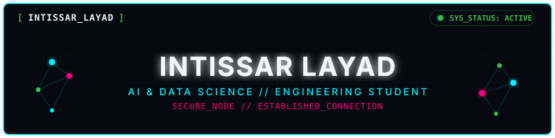

# [ INTISSAR_LAYAD ]



<br>

<div align="center">

[](https://github.com/intissarlayad?tab=repositories)
[](mailto:intissarlayad8@gmail.com)

</div>

**LOC:** ENSAM MEKNES, MOROCCO  
**FOCUS:** VISION, ML & DATA PRODUCT DEV

---

## 01. PROFILE_DIAGNOSTICS

```yaml
Host:            Intissar Layad
Status:          Active Node (AI & Data Science Student)
Academy:         ENSAM Meknes (Morocco)
Mission:         Design robust data pipelines, clean user interfaces, and measurable outcomes.
Languages:       French (Bilingual) // English (Professional) // Darija (Native)
```

---

## 02. CORE_CAPABILITIES

| Area | Technologies |
|---|---|
| **LANGUAGES** |       |
| **AI & MACHINE LEARNING** |      |
| **DATA SCIENCE** |      |
| **VISION & RETRIEVAL** |      |
| **WEB & APPLICATIONS** |     |
| **DATABASES & PIPELINES** |     |

---

## 03. ACTIVE_DEPLOYMENTS

<table width="100%">
  <tr>
    <td width="50%" valign="top">
      <div align="right"><small><code>NODE:01</code></small></div>
      <p><b>VISION // STREAMLIT</b></p>
      <h3><b>KineAssist</b></h3>
      <p>AI-assisted physical therapy platform leveraging real-time camera pose estimation to track rehabilitation, count repetitions, and score exercise execution quality.</p>
      <p><code>Python</code> <code>MediaPipe</code> <code>Streamlit</code> <code>SQLite</code></p>
      <br>
      <a href="https://github.com/intissarlayad/kineassist"><b>DECRYPT REPOSITORY &gt;</b></a>
    </td>
    <td width="50%" valign="top">
      <div align="right"><small><code>NODE:02</code></small></div>
      <p><b>XGBOOST // FORECAST</b></p>
      <h3><b>MatriskAI</b></h3>
      <p>Supply chain intelligence pipeline analyzing QML &amp; ASL quality records to predict material risks, flag supplier anomalies, and recommend mitigation rules.</p>
      <p><code>Python</code> <code>XGBoost</code> <code>Prophet</code> <code>SHAP</code> <code>Docker</code></p>
      <br>
      <a href="https://github.com/intissarlayad/MatriskAI"><b>DECRYPT REPOSITORY &gt;</b></a>
    </td>
  </tr>
  <tr>
    <td width="50%" valign="top">
      <div align="right"><small><code>NODE:03</code></small></div>
      <p><b>CLIP // VECTOR DB</b></p>
      <h3><b>Visual RAG Landmarks</b></h3>
      <p>Multimodal retrieval architecture designed to identify Moroccan historical sites from photos and retrieve bilingual cultural history documents.</p>
      <p><code>CLIP</code> <code>ChromaDB</code> <code>LLMs</code> <code>RAG</code> <code>Python</code></p>
      <br>
      <a href="https://github.com/intissarlayad/Visual-RAG-Moroccan-Landmarks-Identification"><b>DECRYPT REPOSITORY &gt;</b></a>
    </td>
    <td width="50%" valign="top">
      <div align="right"><small><code>NODE:04</code></small></div>
      <p><b>FLASK // TF-IDF</b></p>
      <h3><b>Tohfa Platform</b></h3>
      <p>Moroccan crafts e-commerce web platform integrating a database catalogue and an NLP recommendation engine matching items by descriptive similarity.</p>
      <p><code>Flask</code> <code>Scikit-Learn</code> <code>TF-IDF</code> <code>SQLite</code> <code>Python</code></p>
      <br>
      <a href="https://github.com/intissarlayad/tohfa"><b>DECRYPT REPOSITORY &gt;</b></a>
    </td>
  </tr>
  <tr>
    <td width="50%" valign="top">
      <div align="right"><small><code>NODE:05</code></small></div>
      <p><b>PHP // MVC // SQL</b></p>
      <h3><b>LireO Library</b></h3>
      <p>Structured digital library management system applying object-oriented MVC design pattern, relational database modeling, and automated workflows.</p>
      <p><code>PHP</code> <code>MySQL</code> <code>Tailwind CSS</code> <code>MVC Pattern</code></p>
      <br>
      <a href="https://github.com/intissarlayad/LireO_Digital_Library"><b>DECRYPT REPOSITORY &gt;</b></a>
    </td>
    <td width="50%" valign="top">
      <div align="right"><small><code>NODE:06</code></small></div>
      <p><b>HTML // STATIC CSS</b></p>
      <h3><b>Tohfa Showcase</b></h3>
      <p>Lightweight, highly structured frontend product catalog presenting handcrafted traditional Moroccan items with clean interface grids.</p>
      <p><code>HTML5</code> <code>CSS3</code> <code>JavaScript</code> <code>UI Design</code></p>
      <br>
      <a href="https://github.com/intissarlayad/tohfa-catalogue"><b>DECRYPT REPOSITORY &gt;</b></a>
    </td>
  </tr>
</table>

---

## 04. ESTABLISH_COMMUNICATION

Interested in collaborations, internships, or discussing AI-driven engineering pipelines? Send a message through the system portals.

<div align="center">
<table>
  <tr>
    <td align="center">
      <a href="mailto:intissarlayad8@gmail.com">
        
      </a>
    </td>
    <td align="center">
      <a href="https://linkedin.com/in/intissar-layad-07444b377" target="_blank" rel="noopener noreferrer">
        
      </a>
    </td>
    <td align="center">
      <a href="https://github.com/intissarlayad" target="_blank" rel="noopener noreferrer">
        
      </a>
    </td>
  </tr>
</table>
</div>

---

### System Diagnostics & Activity

<div align="center">
<table>
  <tr>
    <td>
      
    </td>
    <td>
      
    </td>
  </tr>
</table>
</div>

---

<div align="center">


<br>

SECURE CONNECTION ESTABLISHED. READY FOR DEPLOYMENT.

</div>
